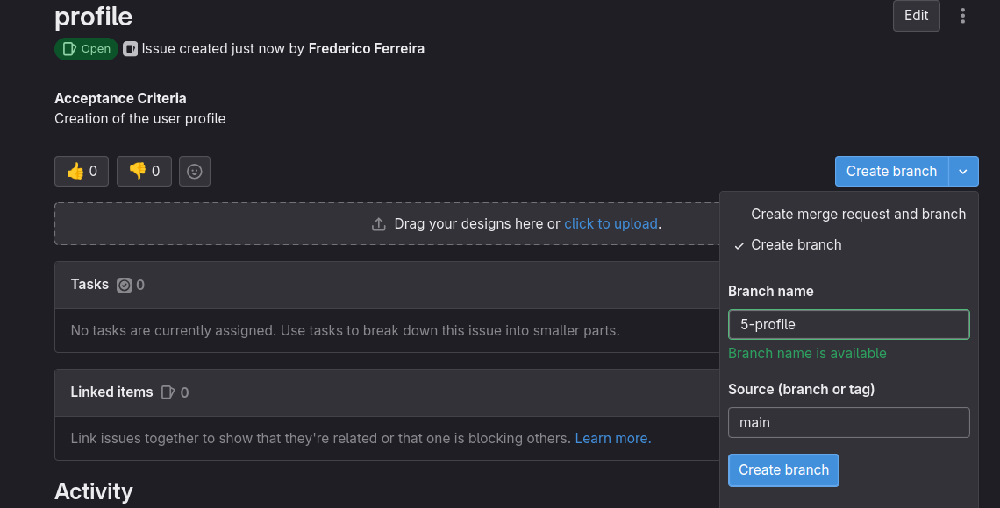

### Issue creation rules
- ###### Issue name: 
| TAG | Description | Issue name example |
| --- | --- | ---- |
| `profile`, `profile-update` | changes to the profile.md | `profile/added-profile` |
| `{feat/refactor/style}-fix` | bugfixing, refactoring, etc... | `refactor-fix/dropdown`, `feat-fix/api` |
| `featBE/...` | implementing a feature in BE | `featBE/created-somehting-something` |

All issue except for `featBE/...` and feat `featFE/...` should follow the format:
```
<TAG>/title
```

Ex: `ctasks/PL02-minute`

- ###### State tag:
	When creating an issue the **state** tag used should be `ready2do` or `doing`. After the creation of the issue this tag should be change.
	
- ###### Stage tag:
	If the issue being done is related to any stage a stage the appropriate stage tag should be added.
	
- ###### Group tag:
	On **every issue** a group tag must be added. If the issue is related to more than group create clone issues.
	
- ###### Time and Estimate
	Every issue must have an estimate, this estimate is a number in the Fibonacci sequence representing the time a certain issue takes to resolve.
	When someone spends time in a given task the time should be added with the `+` sign near the clock used to create the estimate. Each person that worked or reviewed the issue should add the time spent. 
	**This should be done on the issue and not in the MR**
	  
| Points | Time |
| --- | --- | 
| 0 | 0 min |
| 1 | 30min |
| 2 | 60min |
| 3 | 90min |
| 5 | 2h30min |
| 8 | 4h |
| 13 | 7h30min |
| 20 | 12h |
| 40 | 24h |
	
- ###### Assignee
	When a issue is created it should be assigned to the person that is going to work on it. When the issue is going to review the reviewer should **ADD** themselves to the issue and also add the time spent on the review.

- ###### Description
	Every issue description must have a general description and a Definition of Done. 
```
This issue aims to .....

## DoD
- <point1>
- <point2>
```

#### Branch naming convention

The creation of a branch should be done using the name automatically generated (it should follow the rule `<id>-<TAG>/<title>` ). It can be done using the command `git branch <branch-name>` or can be created using the button.



#### Commit naming convention

The commit message should follow one of the following formats

```
<id>-<TAG>/<title>: <commit message>
```

or

```
<id>-<TAG>/<title>

<commit message>
```

- ###### Milestone
  On **every issue** a milestone must be added.

- ###### RUP tag
  On **every issue** a RUP tag must be added.